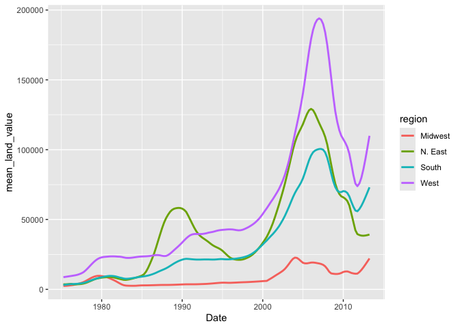
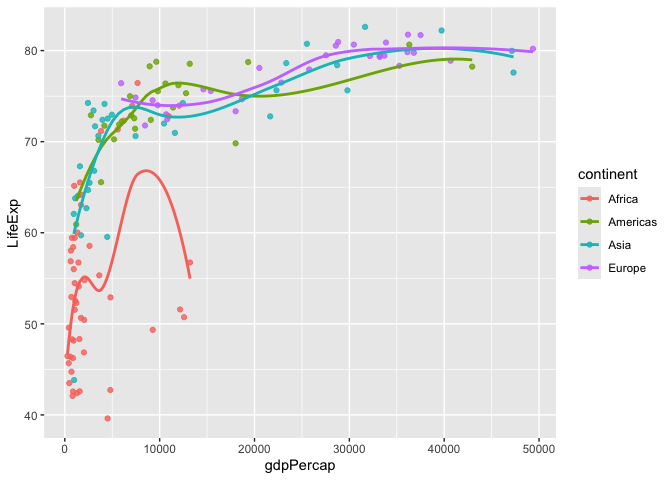
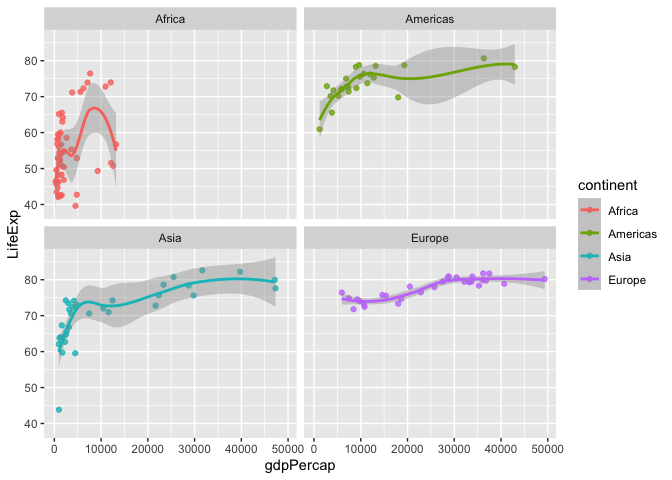
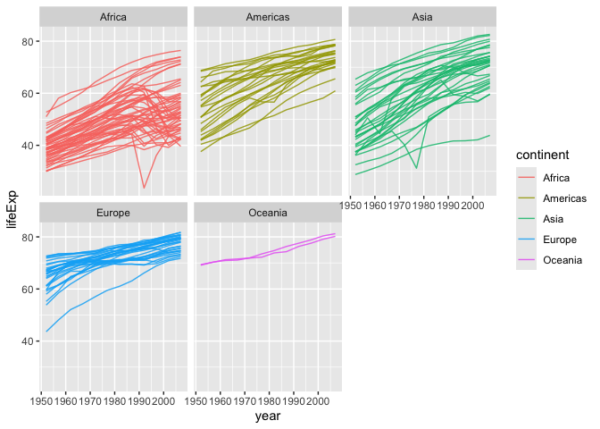
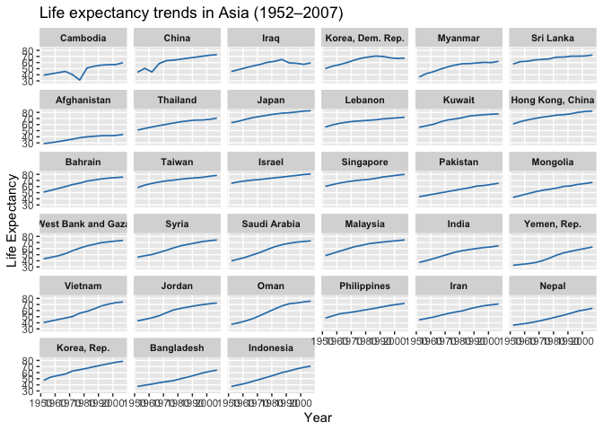

# Assignment 5


# **Assignment 5: Data transformation and visualization - Part 2**

## **Load packages**

``` r
library(tidyverse)
```

    ── Attaching core tidyverse packages ──────────────────────── tidyverse 2.0.0 ──
    ✔ dplyr     1.1.4     ✔ readr     2.1.5
    ✔ forcats   1.0.0     ✔ stringr   1.5.1
    ✔ ggplot2   3.5.1     ✔ tibble    3.2.1
    ✔ lubridate 1.9.4     ✔ tidyr     1.3.1
    ✔ purrr     1.0.2     
    ── Conflicts ────────────────────────────────────────── tidyverse_conflicts() ──
    ✖ dplyr::filter() masks stats::filter()
    ✖ dplyr::lag()    masks stats::lag()
    ℹ Use the conflicted package (<http://conflicted.r-lib.org/>) to force all conflicts to become errors

``` r
library(knitr)
library(gapminder)
```

## Exercise 1. Trends in land values

``` r
housing <- read_csv("https://raw.githubusercontent.com/nt246/NTRES-6100-data-science/master/datasets/landdata_states.csv")
```

    Rows: 7803 Columns: 11
    ── Column specification ────────────────────────────────────────────────────────
    Delimiter: ","
    chr (2): State, region
    dbl (9): Date, Home.Value, Structure.Cost, Land.Value, Land.Share..Pct., Hom...

    ℹ Use `spec()` to retrieve the full column specification for this data.
    ℹ Specify the column types or set `show_col_types = FALSE` to quiet this message.

``` r
housing %>%
  head() %>% 
  kable() 
```

| State | region |    Date | Home.Value | Structure.Cost | Land.Value | Land.Share..Pct. | Home.Price.Index | Land.Price.Index | Year | Qrtr |
|:------|:-------|--------:|-----------:|---------------:|-----------:|-----------------:|-----------------:|-----------------:|-----:|-----:|
| AK    | West   | 2010.25 |     224952 |         160599 |      64352 |             28.6 |            1.481 |            1.552 | 2010 |    1 |
| AK    | West   | 2010.50 |     225511 |         160252 |      65259 |             28.9 |            1.484 |            1.576 | 2010 |    2 |
| AK    | West   | 2009.75 |     225820 |         163791 |      62029 |             27.5 |            1.486 |            1.494 | 2009 |    3 |
| AK    | West   | 2010.00 |     224994 |         161787 |      63207 |             28.1 |            1.481 |            1.524 | 2009 |    4 |
| AK    | West   | 2008.00 |     234590 |         155400 |      79190 |             33.8 |            1.544 |            1.885 | 2007 |    4 |
| AK    | West   | 2008.25 |     233714 |         157458 |      76256 |             32.6 |            1.538 |            1.817 | 2008 |    1 |

#### **1.1 Washington DC was not assigned to a region in this dataset. According to the United States Census Bureau, however, DC is part of the South region. Here:**

> [!NOTE]
>
> - **Change the region of DC to `"South"`  
>   *Hint: there are multiple ways to do this, but `mutate()` and
>   `ifelse()` might be helpful***
>
> - **Create a new tibble or regular dataframe consisting of this new
>   updated `region` variable along with the original variables `State`,
>   `Date` and `Land.Value`*(and no others)***
>
> - **Pull out the records from DC in this new data frame.  
>   *How many records are there from DC? Show the first 6 lines.***

``` r
housing2 <- housing %>%
  mutate(region = ifelse(State == "DC", "South", region)) %>%
  select(region, State, Land.Value, Date)

dc_data <- housing2 %>%
  filter(State == "DC")

nrow(dc_data)
```

    [1] 153

``` r
head(dc_data) %>% 
  knitr::kable()
```

| region | State | Land.Value |    Date |
|:-------|:------|-----------:|--------:|
| South  | DC    |     290522 | 2003.00 |
| South  | DC    |     305673 | 2003.25 |
| South  | DC    |     323078 | 2003.50 |
| South  | DC    |     342010 | 2003.75 |
| South  | DC    |     361999 | 2004.00 |
| South  | DC    |     382792 | 2004.25 |

Answer: There is a total of 153 records from state DC, region South.

#### **1.2 Generate a tibble/dataframe that summarizes the mean land value of each region at each time point and show its first 6 lines.**

``` r
library(dplyr)

region_mean <- housing2 %>%
  group_by(region, Date) %>%
  summarise(mean_land_value = mean(Land.Value, na.rm = TRUE)) %>%
  ungroup()
```

    `summarise()` has grouped output by 'region'. You can override using the
    `.groups` argument.

``` r
region_mean %>% 
  head()  %>% 
  knitr::kable()
```

| region  |    Date | mean_land_value |
|:--------|--------:|----------------:|
| Midwest | 1975.25 |        2452.167 |
| Midwest | 1975.50 |        2498.917 |
| Midwest | 1975.75 |        2608.167 |
| Midwest | 1976.00 |        2780.000 |
| Midwest | 1976.25 |        2967.333 |
| Midwest | 1976.50 |        3212.833 |

#### **1.3 Using the tibble/dataframe from 1.2, plot the trend in mean land value of each region through time.**

``` r
library(ggplot2)

nrow(region_mean)
```

    [1] 612

``` r
ggplot(region_mean, aes(x = Date, y = mean_land_value, color = region)) +
  geom_line(linewidth = 1) +
  labs(x = "Date", y = "mean_land_value", color = "region") +
  theme_grey()
```



## **Exercise 2. Life expectancy and GDP per capita 1952-2007**

This exercise uses the `gapminder` dataset from the `gapminder` package.
It describes the life expectancy (`lifeExp`), GDP per capita
(`gdpPercap`), and population (`pop`) of 142 countries from 1952 to
2007. These countries can be grouped into 5 continents. As a reminder,
**reproduce the following plots exactly as shown**.

``` r
gapminder %>% 
  head() %>% 
  kable()
```

| country     | continent | year | lifeExp |      pop | gdpPercap |
|:------------|:----------|-----:|--------:|---------:|----------:|
| Afghanistan | Asia      | 1952 |  28.801 |  8425333 |  779.4453 |
| Afghanistan | Asia      | 1957 |  30.332 |  9240934 |  820.8530 |
| Afghanistan | Asia      | 1962 |  31.997 | 10267083 |  853.1007 |
| Afghanistan | Asia      | 1967 |  34.020 | 11537966 |  836.1971 |
| Afghanistan | Asia      | 1972 |  36.088 | 13079460 |  739.9811 |
| Afghanistan | Asia      | 1977 |  38.438 | 14880372 |  786.1134 |

#### **2.1 Use a scatterplot to explore the relationship between per capita GDP (`gdpPercap`) and life expectancy (`lifeExp`) in the year 2007.**

``` r
library(gapminder)
gapminder_2007 <- filter(gapminder, year == 2007)
ggplot(gapminder_2007, aes(x = gdpPercap, y = lifeExp)) + 
  geom_point() + 
  labs(x = "gdpPercap", y = "lifeExp")
```


#### **2.2 Add a smoothing line to the previous plot.**

``` r
gapminder_2007 <- filter(gapminder, year == 2007)
ggplot(gapminder_2007, aes(x = gdpPercap, y = lifeExp)) + 
  geom_point() + 
  geom_smooth() + 
  labs(x = "gdpPercap", y = "lifeExp")
```

    `geom_smooth()` using method = 'loess' and formula = 'y ~ x'


#### **2.3 Exclude Oceania from the previous plot, show each continent in a different color, and fit a separate smoothing line to each continent to identify differences in this relationship between continents. Turn off the confidence intervals.**

Note: only two Oceanian countries are included in this dataset, and
`geom_smooth()` does not work with two data points, which is why they
are excluded.

``` r
gapminder_2007_noOC <- filter(gapminder_2007, continent != "Oceania")

ggplot(gapminder_2007_noOC, 
       aes(x = gdpPercap, y = lifeExp, color = continent)) +
  geom_point(alpha = 0.8) +
  geom_smooth(se = FALSE, linewidth = 1) + 
  labs(x = "gdpPercap", y = "LifeExp", color = "continent")
```

    `geom_smooth()` using method = 'loess' and formula = 'y ~ x'



#### **2.4 Use faceting to solve the same problem. Include the confidence intervals in this plot.**

``` r
ggplot(gapminder_2007_noOC, 
       aes(x = gdpPercap, y = lifeExp, color = continent)) +
  geom_point(alpha = 0.8) +
  geom_smooth(se = TRUE, linewidth = 1) + 
  facet_wrap(~ continent) + 
  labs(x = "gdpPercap", y = "LifeExp", color = "continent")
```

    `geom_smooth()` using method = 'loess' and formula = 'y ~ x'



#### **2.5 Explore the trend in life expectancy through time in each continent. Color by continent.**

``` r
gapminder %>%
  ggplot(aes(x = year,
             y = lifeExp,
             group = country, 
             color = continent)) + 
  geom_line(linewidth = 0.5, alpha = 0.85) +
  facet_wrap(~ continent) +  
  labs(x = "year", y = "lifeExp",
       color = "continent")
```



#### **2.6 From the previous plot, we see some abnormal trends in Asia and Africa, where the the life expectancy in some countries sharply dropped at certain time periods. Here, we look into what happened in Asia in more detail. First, create a new dataset by filtering only the Asian countries. Show the first 6 lines of this filtered dataset.**

``` r
Asia_data <- filter(gapminder, continent == "Asia")
head(Asia_data) %>% 
  knitr::kable()
```

| country     | continent | year | lifeExp |      pop | gdpPercap |
|:------------|:----------|-----:|--------:|---------:|----------:|
| Afghanistan | Asia      | 1952 |  28.801 |  8425333 |  779.4453 |
| Afghanistan | Asia      | 1957 |  30.332 |  9240934 |  820.8530 |
| Afghanistan | Asia      | 1962 |  31.997 | 10267083 |  853.1007 |
| Afghanistan | Asia      | 1967 |  34.020 | 11537966 |  836.1971 |
| Afghanistan | Asia      | 1972 |  36.088 | 13079460 |  739.9811 |
| Afghanistan | Asia      | 1977 |  38.438 | 14880372 |  786.1134 |

#### **2.7 Using the filtered dataset, identify the countries that had abnormal trends in life expectancy by plotting, and discuss historical events possibly explaining these trends. (Hint: facet by country)**

``` r
library(forcats)

order_by_drop <- Asia_data %>%
  group_by(country) %>%
  arrange(year, .by_group = TRUE) %>%
  mutate(dlife = lifeExp - lag(lifeExp)) %>%
  summarise(min_drop = min(dlife, na.rm = TRUE), .groups = "drop")

Asia_data_ord <- Asia_data %>%
  left_join(order_by_drop, by = "country") %>%
  mutate(country = fct_reorder(country, min_drop)) 

ggplot(Asia_data_ord, aes(year, lifeExp, group = country)) +
  geom_line(linewidth = 0.6, color = "#2C7FB8") +
  facet_wrap(~ country, ncol = 6) +
  labs(title = "Life expectancy trends in Asia (1952–2007)",
       x = "Year", y = "Life Expectancy") +
  theme(legend.position = "none",
        strip.text = element_text(size = 8, face = "bold"),
        panel.grid.minor = element_blank())
```



Answer: First, we can ask to order the drop by years to be ranked from
the biggest to the smallest then use the plotting and facetting to
identify countries with abnormal trends in life expectancy in Asian
area: Cambodia in 1970s, Iraq from 1980s-2000s, and China in 1960s.

Possible causes of the drop in life expectancy may be due to the civil
war in Cambodia around 1970s, continuous wars in Iraq, and the Great
Chinese Famine occurred in China around 1960s.
