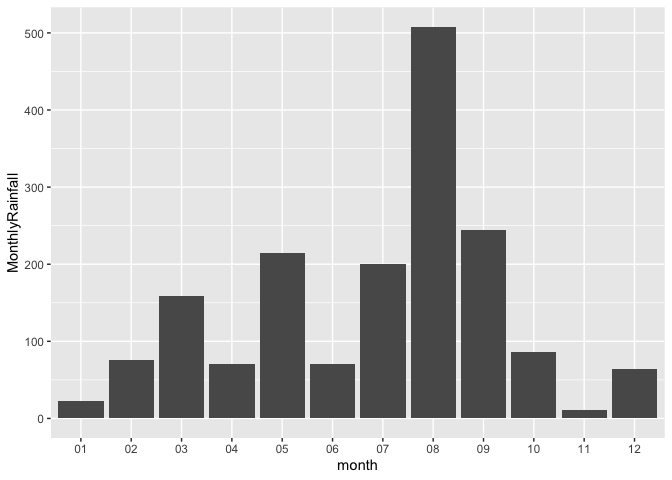

# Assignment 6


# **Data import and tidy data**

## **Load packages**

``` r
library(tidyverse)
```

    ── Attaching core tidyverse packages ──────────────────────── tidyverse 2.0.0 ──
    ✔ dplyr     1.1.4     ✔ readr     2.1.5
    ✔ forcats   1.0.0     ✔ stringr   1.5.1
    ✔ ggplot2   3.5.1     ✔ tibble    3.2.1
    ✔ lubridate 1.9.4     ✔ tidyr     1.3.1
    ✔ purrr     1.0.2     
    ── Conflicts ────────────────────────────────────────── tidyverse_conflicts() ──
    ✖ dplyr::filter() masks stats::filter()
    ✖ dplyr::lag()    masks stats::lag()
    ℹ Use the conflicted package (<http://conflicted.r-lib.org/>) to force all conflicts to become errors

``` r
library(knitr)
```

## Exercise 1. **Tibble and Data Import**

#### **1.1 Create the following tibble manually, first using `tribble()` and then using `tibble()`. Print both results. \[We didn’t have time to cover this in class, but look up how these functions work [here](https://r4ds.had.co.nz/tibbles.html#creating-tibbles)\]**

#### **`tribble():`**

``` r
## # A tibble: 2 × 3
##       a     b c     
##   <dbl> <dbl> <chr> 
## 1     1   2.1 apple 
## 2     2   3.2 orange

tribble(
  ~a, ~b, ~c,
  1, 2.1, "apple",
  2, 3.2, "orange"
)
```

    # A tibble: 2 × 3
          a     b c     
      <dbl> <dbl> <chr> 
    1     1   2.1 apple 
    2     2   3.2 orange

#### **`tibble()`**

``` r
## # A tibble: 2 × 3
##       a     b c     
##   <int> <dbl> <chr> 
## 1     1   2.1 apple 
## 2     2   3.2 orange
tibble(
  a = c(1,2),
  b = c(2.1, 3.2),
  c = c("apple", "orange")
)
```

    # A tibble: 2 × 3
          a     b c     
      <dbl> <dbl> <chr> 
    1     1   2.1 apple 
    2     2   3.2 orange

#### **1.2 Import `https://raw.githubusercontent.com/nt246/NTRES-6100-data-science/master/datasets/dataset2.txt` into R. Change the column names into “Name”, “Weight”, “Price”.**

``` r
## # A tibble: 3 × 3
##   Name   Weight Price
##   <chr>   <dbl> <dbl>
## 1 apple       1   2.9
## 2 orange      2   4.9
## 3 durian     10  19.9

dataset2 <- read_csv("https://raw.githubusercontent.com/nt246/NTRES-6100-data-science/master/datasets/dataset2.txt")
```

    Rows: 2 Columns: 3
    ── Column specification ────────────────────────────────────────────────────────
    Delimiter: ","
    chr (1): apple
    dbl (2): 1, 2.9

    ℹ Use `spec()` to retrieve the full column specification for this data.
    ℹ Specify the column types or set `show_col_types = FALSE` to quiet this message.

``` r
colnames(dataset2) <- c("Name", "Weight", "Price")

dataset2
```

    # A tibble: 2 × 3
      Name   Weight Price
      <chr>   <dbl> <dbl>
    1 orange      2   4.9
    2 durian     10  19.9

#### **1.3 Import `https://raw.githubusercontent.com/nt246/NTRES-6100-data-science/master/datasets/dataset3.txt` into R. Watch out for the first few lines, missing values, separators, quotation marks, and deliminaters.**

``` r
## # A tibble: 3 × 3
##   Name   Weight Price
##   <chr>   <dbl> <dbl>
## 1 apple       1   2.9
## 2 orange      2  NA  
## 3 durian     NA  19.9

dataset3 <- read_delim(
  "https://raw.githubusercontent.com/nt246/NTRES-6100-data-science/master/datasets/dataset3.txt",
  delim = ";",   
  skip = 2,
  na = c("?", "Not Available")
)
```

    Rows: 3 Columns: 3
    ── Column specification ────────────────────────────────────────────────────────
    Delimiter: ";"
    chr (1): /Name/
    dbl (2): /Weight/, /Price/

    ℹ Use `spec()` to retrieve the full column specification for this data.
    ℹ Specify the column types or set `show_col_types = FALSE` to quiet this message.

``` r
dataset3
```

    # A tibble: 3 × 3
      `/Name/` `/Weight/` `/Price/`
      <chr>         <dbl>     <dbl>
    1 /apple/           1       2.9
    2 /orange/          2      NA  
    3 /durian/         NA      19.9

## **Exercise 2. Weather station**

This dataset contains the weather and air quality data collected by a
weather station in Taiwan. It was obtained from the Environmental
Protection Administration, Executive Yuan, R.O.C. (Taiwan).

#### **2.1 Variable descriptions**

- The text file
  `https://raw.githubusercontent.com/nt246/NTRES-6100-data-science/master/datasets/2015y_Weather_Station_notes.txt`
  contains descriptions of different variables collected by the station.

- Import it into R and print it in a table as shown below with
  `kable()`.

``` r
WS_notes <- read_delim("https://raw.githubusercontent.com/nt246/NTRES-6100-data-science/master/datasets/2015y_Weather_Station_notes.txt",
                       delim = "-",
                       trim_ws = TRUE)
```

    Rows: 15 Columns: 3
    ── Column specification ────────────────────────────────────────────────────────
    Delimiter: "-"
    chr (3): Item, Unit, Description

    ℹ Use `spec()` to retrieve the full column specification for this data.
    ℹ Specify the column types or set `show_col_types = FALSE` to quiet this message.

``` r
kable(WS_notes)
```

| Item       | Unit    | Description                                               |
|:-----------|:--------|:----------------------------------------------------------|
| AMB_TEMP   | Celsius | Ambient air temperature                                   |
| CO         | ppm     | Carbon monoxide                                           |
| NO         | ppb     | Nitric oxide                                              |
| NO2        | ppb     | Nitrogen dioxide                                          |
| NOx        | ppb     | Nitrogen oxides                                           |
| O3         | ppb     | Ozone                                                     |
| PM10       | μg/m3   | Particulate matter with a diameter between 2.5 and 10 μm  |
| PM2.5      | μg/m3   | Particulate matter with a diameter of 2.5 μm or less      |
| RAINFALL   | mm      | Rainfall                                                  |
| RH         | %       | Relative humidity                                         |
| SO2        | ppb     | Sulfur dioxide                                            |
| WD_HR      | degress | Wind direction (The average of hour)                      |
| WIND_DIREC | degress | Wind direction (The average of last ten minutes per hour) |
| WIND_SPEED | m/sec   | Wind speed (The average of last ten minutes per hour)     |
| WS_HR      | m/sec   | Wind speed (The average of hour)                          |

`#` indicates invalid value by equipment inspection  
`*` indicates invalid value by program inspection  
`x` indicates invalid value by human inspection  
`NR` indicates no rainfall  
blank indicates no data

#### **2.2 Data tidying**

- Import
  `https://raw.githubusercontent.com/nt246/NTRES-6100-data-science/master/datasets/2015y_Weather_Station.csv`
  into R. As you can see, this dataset is a classic example of untidy
  data: values of a variable (i.e. hour of the day) are stored as column
  names; variable names are stored in the `item` column.

- Clean this dataset up and restructure it into a tidy format.

- Parse the `date` variable into date format and parse `hour` into time.

- Turn all invalid values into `NA` and turn `NR` in rainfall into `0`.

- Parse all values into numbers.

- Show the first 6 rows and 10 columns of this cleaned dataset, as shown
  below, *without* using `kable()`.

*Hints: you don’t have to perform these tasks in the given order; also,
warning messages are not necessarily signs of trouble.*

``` r
ws_clean <- read_csv(
  "https://raw.githubusercontent.com/nt246/NTRES-6100-data-science/master/datasets/2015y_Weather_Station.csv",
  col_types = cols(.default = "c") 
) %>%
  pivot_longer(
    cols = matches("^(X)?\\d{2}$"), 
    names_to = "hour", 
    values_to = "value"
  ) %>%
  mutate(
    hour  = str_remove(hour, "^X"),
    hour  = hms::as_hms(sprintf("%02d:00:00", as.integer(hour))), 
    value = na_if(value, ""),
    value = if_else(value %in% c("#","*","x"), NA, value),
    value = if_else(item == "RAINFALL" & value == "NR", "0", value),
    value = as.numeric(value),
    date  = as.Date(date)
  ) %>%
  pivot_wider(names_from = item, values_from = value) %>%
  arrange(date, hour)
```

    Warning: There was 1 warning in `mutate()`.
    ℹ In argument: `value = as.numeric(value)`.
    Caused by warning:
    ! NAs introduced by coercion

``` r
ws_clean %>% select(1:10) %>% head(6)
```

    # A tibble: 6 × 10
      date       station hour   AMB_TEMP    CO    NO   NO2   NOx    O3  PM10
      <date>     <chr>   <time>    <dbl> <dbl> <dbl> <dbl> <dbl> <dbl> <dbl>
    1 2015-01-01 Cailiao 00:00        16  0.74   1      15    16    35   171
    2 2015-01-01 Cailiao 01:00        16  0.7    0.8    13    14    36   174
    3 2015-01-01 Cailiao 02:00        15  0.66   1.1    13    14    35   160
    4 2015-01-01 Cailiao 03:00        15  0.61   1.7    12    13    34   142
    5 2015-01-01 Cailiao 04:00        15  0.51   2      11    13    34   123
    6 2015-01-01 Cailiao 05:00        14  0.51   1.7    13    15    32   110

#### **2.3 Using this cleaned dataset, plot the daily variation in ambient temperature on September 25, 2015, as shown below.**

``` r
ws_clean %>%
  filter(date == as.Date("2015-09-25")) %>%
  ggplot(aes(x = hour, y = AMB_TEMP)) +
  geom_line()
```


#### **2.4 Plot the daily average ambient temperature throughout the year with a continuous line, as shown below.**

``` r
ws_clean %>%
  group_by(date) %>%
  summarise(daily_average_ambient_temp = mean(AMB_TEMP, na.rm = TRUE)) %>%
  ggplot(aes(x = date, y = daily_average_ambient_temp)) +
  geom_line()
```


#### **2.5 Plot the total rainfall per month in a bar chart, as shown below.**

*Hint: separating date into three columns might be helpful.*

``` r
ws_clean %>%
  mutate(month = format(date, "%m")) %>%
  group_by(month) %>%
  summarise(MonthlyRainfall = sum(RAINFALL, na.rm = TRUE)) %>%
  ggplot(aes(x = month, y = MonthlyRainfall)) +
  geom_col()
```



#### **2.6 Plot the per hour variation in PM2.5 in the first week of September with a continuous line, as shown below.**

*Hint: uniting the date and hour and parsing the new variable might be
helpful.*

``` r
ws_clean %>%
  filter(date >= "2015-09-01", date < "2015-09-08") %>%
  unite("datetime", date, hour, sep = " ") %>%
  mutate(datetime = as.POSIXct(datetime, format = "%Y-%m-%d %H:%M:%S")) %>%
  ggplot(aes(x = datetime, y = PM2.5)) +
  geom_line()
```


